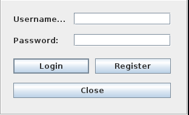
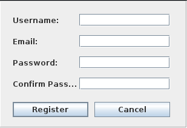
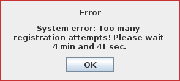
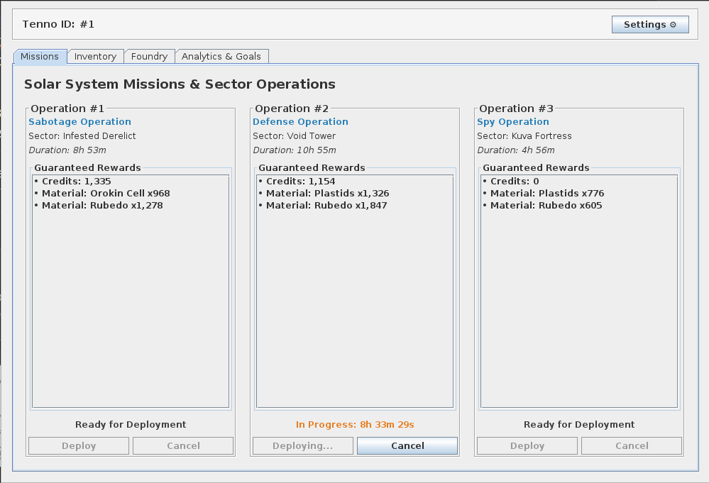
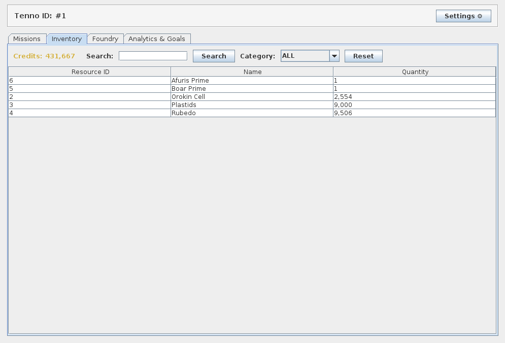
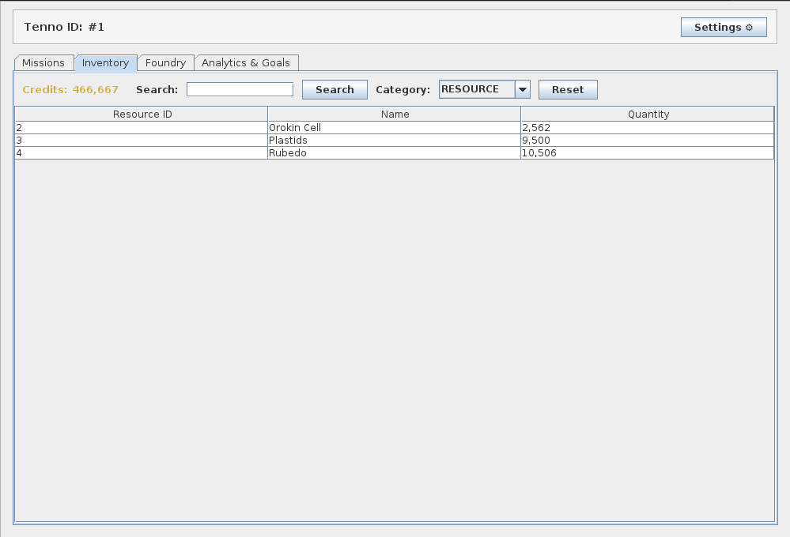
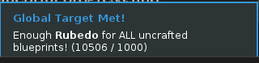
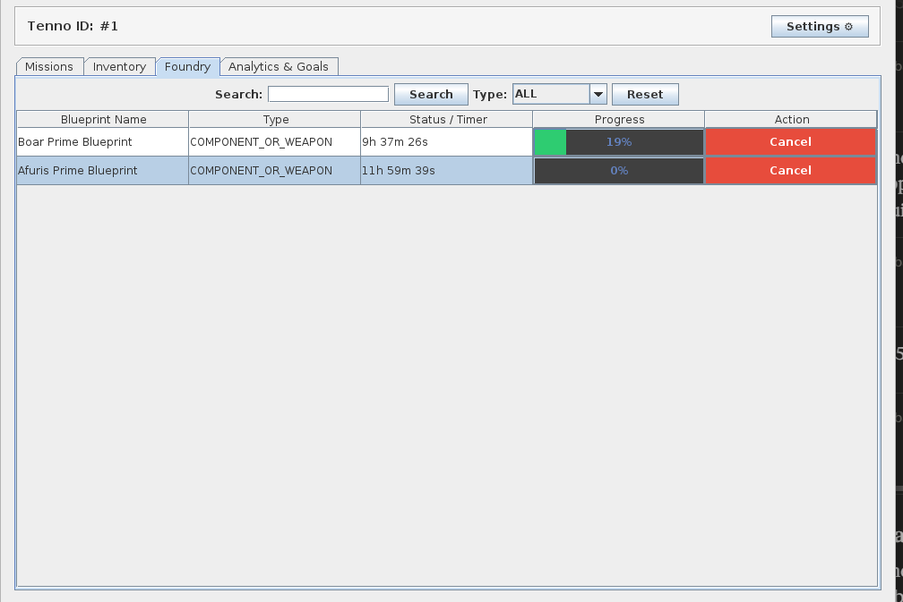
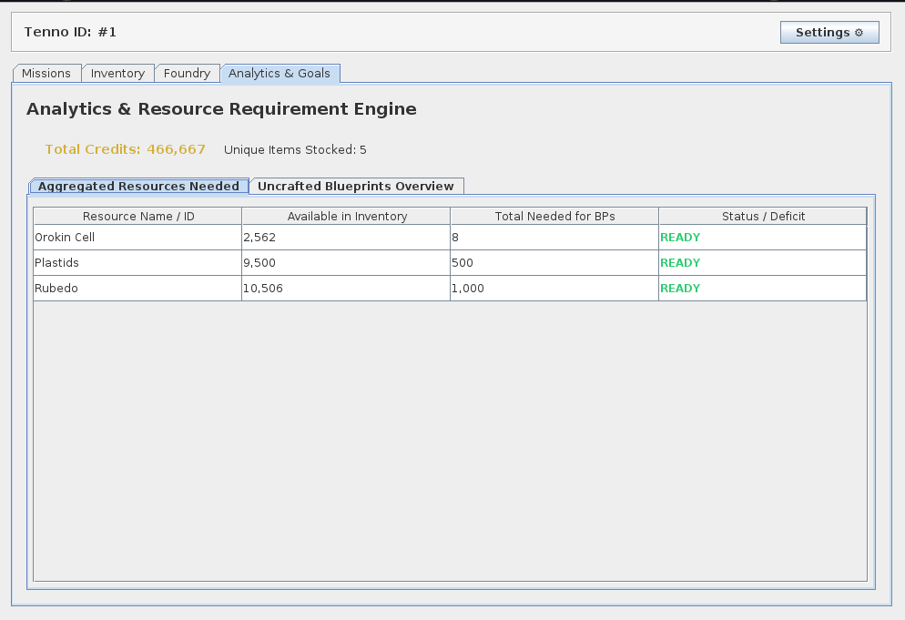
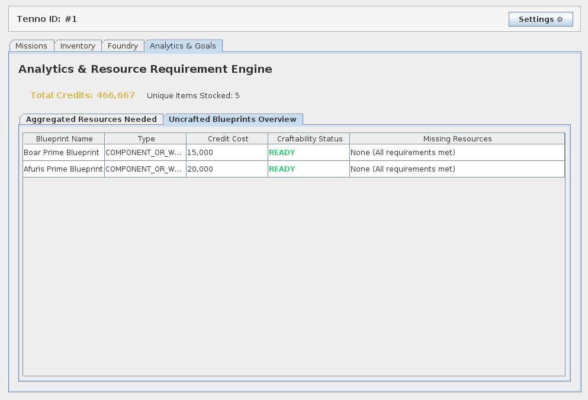

# Smart Inventory System

**Desktop inventory and crafting manager for Warframe — Java, MySQL, Redis**

A desktop inventory and crafting manager inspired by *Warframe*'s Foundry system — rebuilt to actually be usable. Instead of manually digging through thousands of resources to figure out what a blueprint needs and how much of it you're missing, this app tracks your stock, tells you exactly what's still required, and alerts you the moment a blueprint (or a shared resource across *all* your pending blueprints) is ready to build.

## Why this exists

Warframe's own inventory/foundry UI makes you cross-reference resource counts against blueprint requirements by hand, one item at a time. With thousands of resources and dozens of blueprints in progress, that's tedious and error-prone. This project automates the bookkeeping: track what you have, track what you need, and get notified automatically when you're ready to craft.

## Features

- **Inventory tracking** — manage resource quantities and see live stock levels.
- **Foundry / crafting system** — browse blueprints by category, start crafting, and consume the correct resources and credits automatically.
- **Automatic readiness alarms**, built on an Observer pattern:
  - **Blueprint Threshold Watcher** — notifies you the instant a specific uncrafted blueprint has every resource it needs.
  - **Global Target Watcher** — notifies you when your stock of a resource covers the combined requirement across *every* uncrafted blueprint at once, so you know when you can stop farming a given material entirely.
- **Missions** — track mission state and rewards alongside your inventory.
- **Analytics panel** — overview of inventory/crafting data.
- **Accounts** — registration and login with hashed passwords, backed by MySQL.

## Walkthrough

### Getting in

You start at a plain login screen. New Tenno? Register with a username, email, and password — the app validates and sanitizes everything before it's accepted (empty fields, mismatched passwords, malformed emails all get caught immediately), and repeated failed attempts trip Redis-backed rate limiting and device lockout rather than being allowed to hammer the server.

| Login | Register |
|---|---|
|  |  |

| Validation error | Rate-limit error |
|---|---|
|  |  |

### Missions

Once you're in, the **Missions** tab lists available Solar System operations, each with its sector, duration, and guaranteed rewards. Deploy an operation and it starts counting down; while it's running you can cancel it, and completed missions feed materials and credits straight into your inventory.



### Inventory

The **Inventory** tab is a searchable, filterable table of everything you're carrying — resources, prime parts, credits — instead of Warframe's paginated, un-sortable list. Filter by category, search by name, and see exact quantities at a glance.

| Full inventory | Filtered by category |
|---|---|
|  |  |

This is also where the alarms pay off: the moment a resource's stock covers what's needed across every uncrafted blueprint, a toast notification tells you so — no more manually adding up requirements across dozens of blueprints.



### Foundry

The **Foundry** tab shows every blueprint you own, its type, build progress, and remaining time, with the ability to search, filter by type, and cancel an in-progress build. Starting a craft automatically deducts the right credits and resources.



### Analytics & Goals

This is the piece Warframe doesn't give you at all: an **Analytics & Resource Requirement Engine** that aggregates every resource needed across *all* your uncrafted blueprints into one table, showing what you have versus what you still need and flagging each as ready or short.



A second view flips it around by blueprint — for each uncrafted blueprint, its credit cost, craftability status, and exactly which resources (if any) are still missing.



## Tech Stack

| Layer | Technology |
|---|---|
| Language | Java 21 |
| UI | Java Swing |
| Persistent storage | MySQL |
| Sessions / rate limiting / caching | Redis (Jedis client) |
| Password hashing | jBCrypt |
| Build | Maven (Shade plugin for a runnable fat JAR) |
| Containerization | Docker / Docker Compose |

## Architecture

The codebase follows a layered architecture built around two core design patterns:

- **Repository pattern** — every domain area (`auth`, `inventory`, `mission`) defines a repository interface in `service/`, with concrete MySQL or Redis implementations in `infrastructure/`. This keeps the service layer and UI decoupled from the specific data store.
- **Observer pattern** — the inventory publishes `InventoryChangedEvent`s whenever stock changes. Watchers (`BlueprintThresholdWatcher`, `GlobalTargetWatcher`) subscribe as `InventoryObserver`s and independently decide whether an alarm should fire, without the inventory service needing to know about alarms at all.

```
org.example
├── model/            # Domain objects (User, Blueprint, ResourceComponent, Mission, ...)
├── service/           # Business logic + repository interfaces (auth, inventory, mission)
├── infrastructure/    # MySQL/Redis repository implementations, DB connections, alarms
├── ui/                # Swing views (Login, Register, Main, Inventory, Foundry, Missions, Analytics)
└── util/              # Logging, device identification, UI helpers
```

## Security

- Database and Redis credentials are never hardcoded — all sensitive configuration is read from environment variables, which are **not** committed to the repository (`.env` is git-ignored; `.env.example` documents the required variables).
- Passwords are hashed with bcrypt (jBCrypt); plaintext passwords are never stored.
- All user input is validated and sanitized before use.
- All data access goes through the repository/service layers — the UI never queries the database directly.
- Inventory, foundry and mission actions require an authenticated session.
- **Rate limiting** (Redis-backed) caps login and registration attempts both globally and per-device.
- **Device lockout** (Redis-backed) temporarily blocks a device after repeated failed login attempts.
- User sessions are managed through Redis rather than kept only in memory.
- Error messages shown to the user never leak stack traces or internal details.
- Application events (auth, inventory, foundry, warnings) are logged for auditing and debugging via a dedicated logger.

## Getting Started

### Prerequisites

- JDK 21+
- Maven
- Docker & Docker Compose (recommended — spins up MySQL and Redis for you)

### Setup

1. Clone the repository.
2. Copy `.env.example` to `.env` and fill in your own values:
   ```
   DB_HOST=localhost
   DB_PORT=3306
   DB_NAME=warframe_foundry
   DB_USER=root
   DB_ROOT_PASSWORD=your_mysql_root_password_here

   REDIS_HOST=localhost
   REDIS_PORT=6379
   ```
3. Start MySQL and Redis:
   ```bash
   docker compose up -d
   ```
   The MySQL schema in `sql/init.sql` is applied automatically on first startup.
4. Build the project:
   ```bash
   mvn clean package
   ```
5. Run the application:
   ```bash
   java -jar target/Code-1.0-SNAPSHOT.jar
   ```

## Database

The schema (`sql/init.sql`) includes tables for users, login attempts, item categories, items, blueprints, blueprint resource requirements, per-user inventory and blueprint progress, and missions with their rewards. The database holds 600+ resources and items.

## Status

This is a personal project built to solve a genuinely annoying problem in Warframe's UX. Contributions, suggestions, and issue reports are welcome.

*Not affiliated with or endorsed by Digital Extremes. Warframe is a trademark of Digital Extremes Ltd.*
